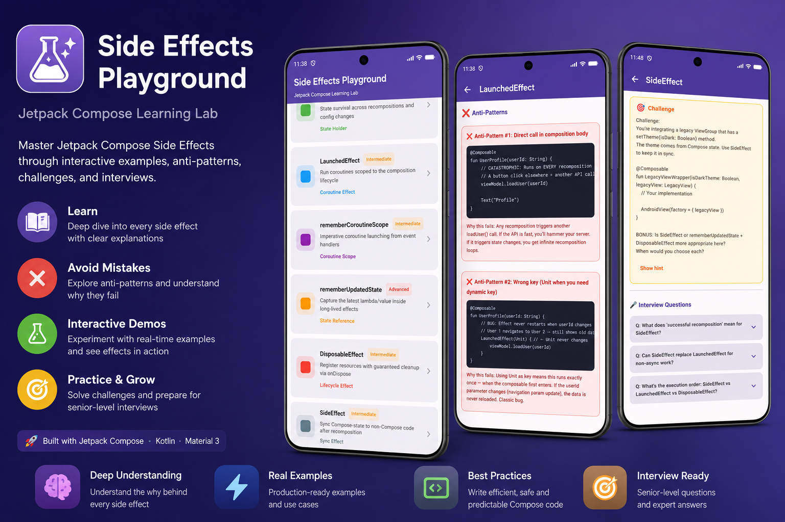

# Compose Side Effects Playground




An advanced educational Android application built to deeply understand Jetpack Compose Side Effects, recomposition, coroutine lifecycle, and the Compose runtime through real-world interactive experiments.

Built with:
- Kotlin
- Jetpack Compose
- Material 3
- MVVM
- StateFlow
- Coroutines
- Navigation Compose

---

# Goal

This project is NOT a simple Compose demo.

It is a complete interactive learning playground designed to help Android developers truly understand:

- Compose side effects
- Recomposition behavior
- Coroutine cancellation & restart
- Snapshot system
- State observation
- Stability & performance
- Lifecycle-aware effects
- Compose runtime mental model

---

# Screens Included

## Side Effects Covered

- LaunchedEffect
- rememberCoroutineScope
- rememberUpdatedState
- DisposableEffect
- SideEffect
- produceState
- derivedStateOf
- snapshotFlow
- remember
- rememberSaveable

---

# What Each Screen Contains

Every screen follows the same educational structure:

### 📘 Theory Box
Precise explanation of the side effect:
- what it does
- when it runs
- lifecycle behavior
- recomposition interaction
- coroutine behavior

---

### ❌ Anti-Pattern Section
Wrong implementations intentionally included to demonstrate:
- infinite recompositions
- stale lambda issues
- unnecessary coroutine restarts
- memory leaks
- unstable state problems
- lifecycle bugs

Each anti-pattern explains:
- WHY it fails
- WHAT Compose runtime is doing internally
- HOW recomposition behaves

---

### ✅ Correct Pattern Section
Production-quality implementation using modern Compose best practices.

Includes:
- lifecycle-safe patterns
- optimized state handling
- proper coroutine management
- scalable architecture
- performance considerations

---

### 🔬 Live Interactive Playground
Interactive controls to experiment with:
- recomposition triggering
- coroutine restart behavior
- state mutations
- lifecycle attach/detach
- configuration changes
- timers
- scroll tracking
- snapshot observation

---

### 📋 Real-Time Composition Log
Visual debugging tools showing:
- recomposition count
- effect restart events
- state changes
- coroutine cancellation
- lifecycle events

---

### 🎯 Challenges & Exercises
Each module contains:
- beginner challenges
- intermediate exercises
- advanced runtime problems

Includes:
- hints
- expected behavior
- solution explanations
- common mistakes

---

### 🎤 Senior-Level Interview Q&A
Expandable interview cards with:
- real Android interview questions
- tricky runtime edge cases
- performance discussions
- lifecycle questions
- architecture discussions

---

# Project Structure

```text
SideEffectsPlayground/
│
├── app/build.gradle.kts
├── gradle/libs.versions.toml
├── app/src/main/
│
├── AndroidManifest.xml
├── PlaygroundApp.kt
├── MainActivity.kt
│
├── navigation/
│   └── Navigation.kt
│
├── ui/
│   ├── theme/
│   ├── components/
│   └── screens/
│
├── domain/
│
└── util/
```

---

# Architecture

The project follows modern Android architecture principles:

- MVVM
- Unidirectional Data Flow (UDF)
- Immutable UI State
- StateFlow
- Clean UI separation
- Feature-based organization

---

# Learning Focus

This project deeply explains:

## Compose Runtime
- composition
- recomposition
- invalidation
- slot table
- restart groups

## State System
- snapshots
- observable reads
- state ownership
- state hoisting

## Performance
- stability
- skippability
- derivedStateOf optimization
- unnecessary recompositions

## Coroutines in Compose
- structured concurrency
- cancellation
- restart keys
- effect lifecycle

---

# Why This Project Exists

Many developers can build Compose UIs.

Far fewer truly understand:
- WHY recomposition happens
- WHY effects restart
- HOW snapshots work
- HOW to optimize Compose
- HOW to avoid runtime bugs

This project focuses on those deeper concepts.

---

# Recommended Audience

Perfect for:
- Android developers learning Compose deeply
- developers preparing for senior interviews
- engineers migrating from XML to Compose
- developers wanting to understand the Compose runtime
- Android educators and mentors

---

# Future Improvements

Planned additions:
- runtime tracing visualizer
- custom Compose runtime inspector
- performance benchmark module
- compiler stability examples
- advanced snapshot debugging
- animations & side effects module
- multi-module architecture version

---

# Contributions

Contributions, improvements, and additional experiments are welcome.

Feel free to open:
- issues
- pull requests
- optimization ideas
- additional side effect scenarios

